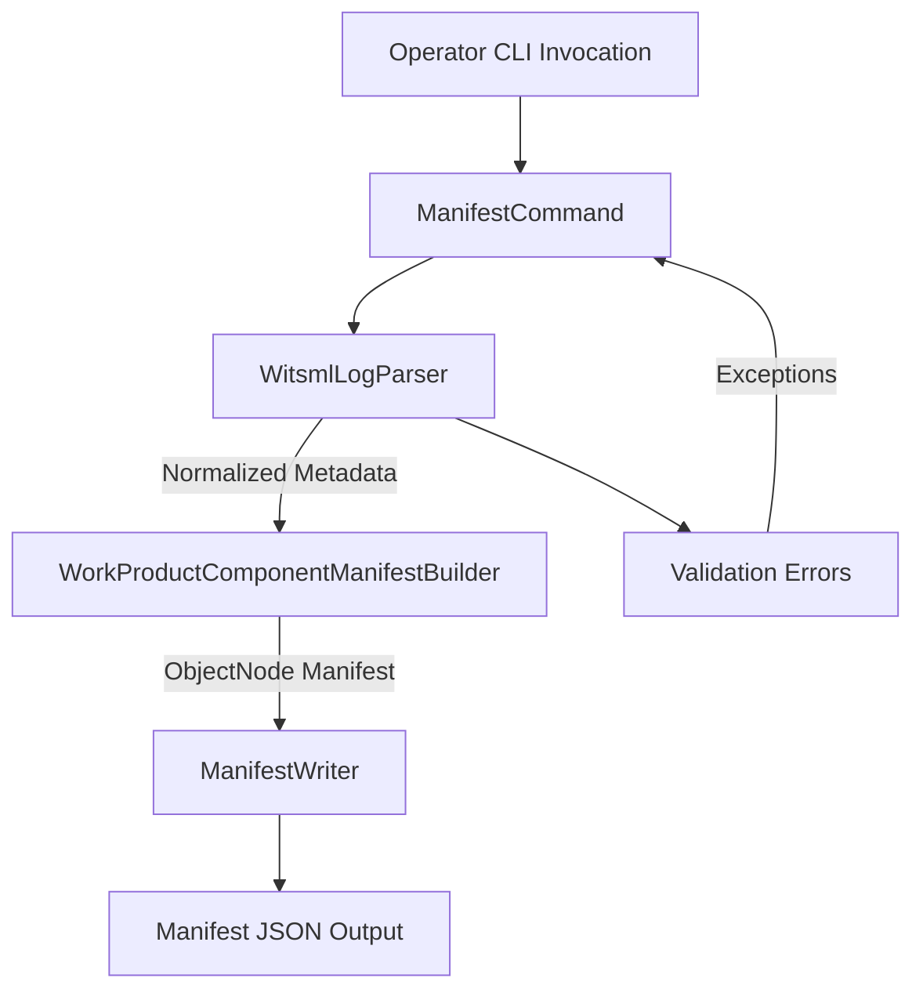

# Technical Design Document: OSDU Manifest Generator (Quarkus CLI)

## The Problem

Ingesting legacy WITSML into OSDU is error-prone due to complex schema mapping, inconsistent metadata quality, and manual validation cycles. Platform teams juggle varying WITSML schema revisions, ACL rules, and legal tags, often relying on spreadsheets and ad hoc scripts that degrade data fidelity and delay ingestion.

## The Solution

A Quarkus-native CLI that automates schema validation, parses WITSML logs, and produces WorkProductComponent manifests aligned with OSDU standards. The tool normalizes metadata, applies configurable ACL/legal policies, and emits deterministic JSON ready for ingestion pipelines.

## Architecture Overview



### Component Responsibilities

- ManifestCommand orchestrates CLI options, directory scanning, and error handling.
- WitsmlLogParser applies secure XML parsing, extracts WITSML metadata, and surfaces schema versioning.
- WorkProductComponentManifestBuilder maps metadata into OSDU WorkProductComponent structures including ACL/legal sections.
- ManifestWriter renders formatted JSON while enforcing overwrite safeguards.

## Deployment and Usage

Compile the CLI in JVM mode:

```shell
mvn clean package
java -jar target/quarkus-app/quarkus-run.jar --input samples --output manifest.json --overwrite
```

Key flags provide ACL ownership, viewer scopes, legal tags, and data partition overrides. The samples directory ships with a Volve-style WITSML XML to exercise the parser, while schemas offers a placeholder WorkProductComponent schema reference.

## Obtaining WITSML Test Data

- **Equinor Volve Data Village**: Register for free access and download the drilling and well logs package that includes WITSML exports via [Equinor Volve Data Village](https://www.equinor.com/energy/volve-data-sharing). These files mirror real-world metadata variations and are ideal for schema validation.
- **OSDU Sample Datasets**: The OSDU Community repositories occasionally publish anonymized WITSML bundles for platform demonstrations; clone the `sample-data` repository hosted at [OSDU Sample Data GitLab](https://community.opengroup.org/osdu/platform/sample-data) and extract the `.xml` artefacts.
- **Internal Corporate Archives**: Many operators maintain historical WITSML exports; sanitize sensitive attributes and place them under the `samples` folder before validating against the manifest generator.

After acquiring WITSML XML files, place them under a dedicated folder (for example `samples/volve`) and point the CLI `--input` flag at that location to validate the generated OSDU manifests.

## Supported Standards

- **WITSML**: Tested with 1.4.1 (1.x “1-series”) schema definitions. The namespace-aware parser also accepts 1.3.x logs that use identical element names; extend `WitsmlLogParser` if you need 2.0+ JSON variants.
- **OSDU**: Emits WorkProductComponent manifests marked `osdu:wks:work-product-component:1.0.0`, aligned with OSDU R3/M15 data ecosystem expectations. Adjust `WorkProductComponentManifestBuilder` constants if you target future schema revisions.
